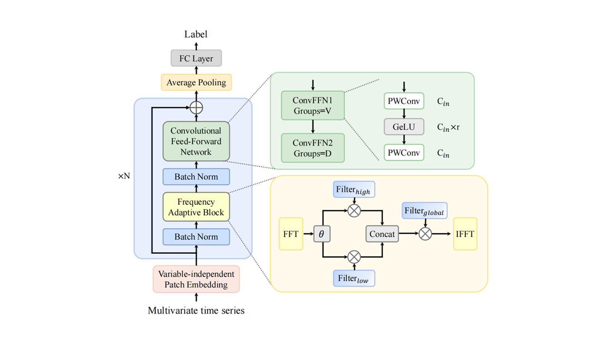

# Convolutional Network Integrated with Frequency Adaptive Learning for Multivariate Time Series Classification

This repository is the official PyTorch implementation of "_Convolutional Network Integrated with Frequency Adaptive Learning for Multivariate Time Series Classification_"
## 📖 Abstract
Multivariate time series classification (MTSC) is a significant research topic in the realm of data mining, with broad applications in different industrial, including healthcare, finance, meteorology,and traffic. While existing studies have designed many classifiers based on LSTMs, CNNs, and Transformer, the sophisticated architectures raise concerns regarding efficiency in computation. Additionally, most methods concentrate on a single dimension, typically temporal patterns, without fully considering multi-dimensional information such as the independence and interactions across variables that are essential in multivariate settings. To address these challenges, this paper introduces FreConvNet, a lightweight convolutional network integrated with frequency adaptive learning. Inheriting the modular design paradigm of Transformer to achieve multi-view modeling of multivariate time series. FreConvNet consists of two key components: the frequency adaptive block (FAB) and the convolutional feed-forward network (ConvFFN). The FAB leverages the Fourier Transform in conjunction with adaptive filters to capture both long-term and short-term dependencies in the temporal dimension. Following that, ConvFFN captures cross-variable and cross-feature interactions by controlling inter-channel information flow through grouped pointwise convolutions, while introducing non-linearity to enhance representational capacity. Extensive experiments conducted on the well-known UEA archive validate that FreConvNet outperforms existing convolution-based, Transformer-based, and hybrid methods in classification performance, offers a computationally efficient solution.

## Architecture

<!--## 📑 Citation
if you find this repo useful, please cite our paper.-->

## 🙏 Acknowledgements
We appreciate the following github repos a lot for their valuable code base or datasets:
- TSLANet (https://github.com/emadeldeen24/TSLANet)
- ModernTCN (https://github.com/luodhhh/ModernTCN)
- datasets (https://github.com/thuml/Time-Series-Library)
